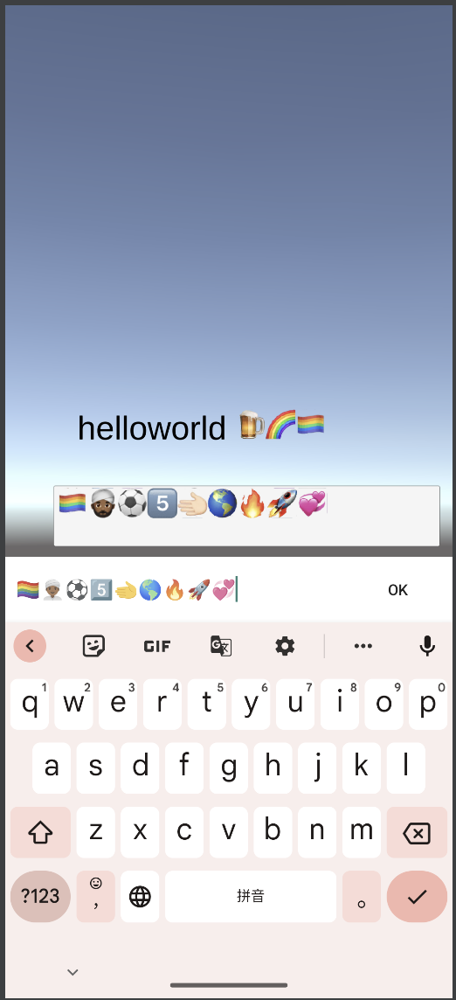
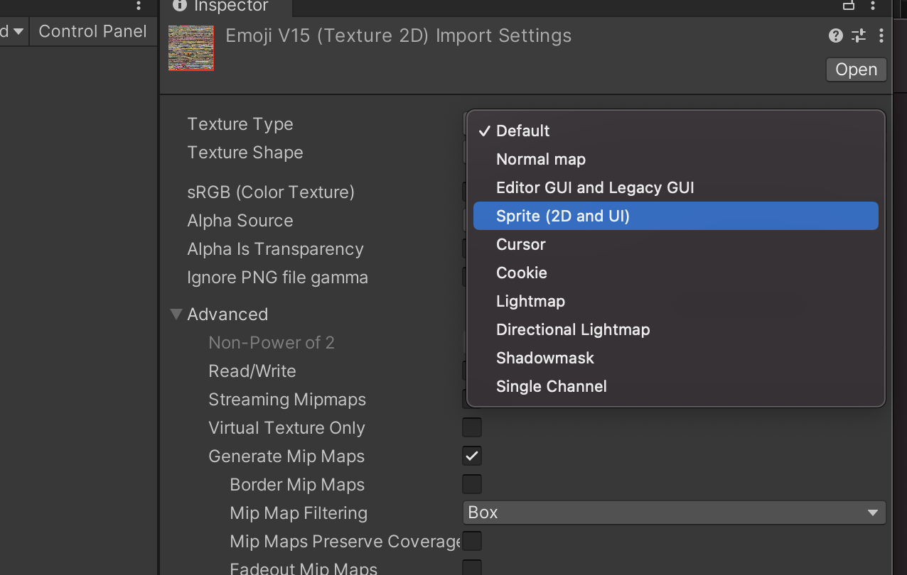
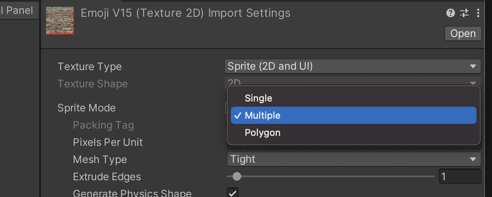
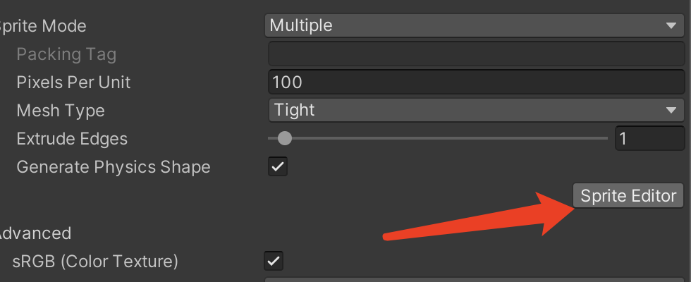

# Produce Full Emoji Texture in Unity

The demo include 3864 emojis that you can use it directly. include 32px and 64px size 

## Requirement

1. Python3, pip
2. Unity

Based on TextMeshPro, Test on Android Platform,replace TextMeshPro into TMP_EmojiTextUGUI

Reference [UnityFullEmojiSample](https://github.com/hsiunien/UnityEmojiSearch/tree/main/UnityFullEmojiSample) ,Clone it and run it. 

# Add More Emoji or modify Emoji

##  Step 1. download full image from unicode.org

## Step2

2

3

